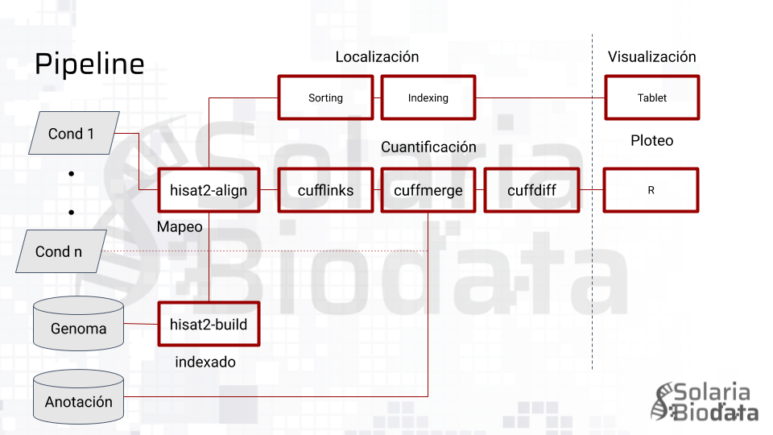

# Curso de Análisis de Datos de RNA-Seq

## Sesión Práctica del Día 05

### Descripción
Realizaremos un análisis de Expresión diferencial, utilizando una serie de desarrollos enfocados a la construcción de índices, mapeo de secuencias con respecto a un genoma de referencia y la cuantificación de perfiles de expresión (abundancia de transcritos) para realizar comparaciones cuantitativas entre distintas condiciones.
### Requisitos

Para poder realizar este ejercicio, necesitaremos:

1. Datos de secuencias:
    - Puedes usar tus propias secuencias, en formato FASTQ o FASTQ.GZ
2. Acceso a los siguientes recursos de internet:
    - Página de [NCBI](https://www.ncbi.nlm.nih.gov/)
    - Página de [SRA](https://www.ncbi.nlm.nih.gov/sra)
3. Sofware Recomendable para esta sesión:
    - Terminal (Mac o Linux)
    - Putty (Windows)
    - WinSCP (Windows)

## Ejercicio 01: Pipeline de Mapeo y Expresión Diferencial
### Descripción
 El pipeline general de este ejercicio es:

### Instrucciones (Parte 01)
1. Sobre la raíz del material del curso, crearemos nuestra carpeta de ejercicio
    ~~~
    mkdir mi_nombre/mapping_rnaseq
    ~~~
2. Realizaremos un enlace simbólico respecto a nuestra carpeta de trabajo
    ~~~
    ln -s ~/cursoRNASeq/raw/ ~/mi_nombre/
    ~~~
3. En el espacio de trabajo, realizaremos el Indexado del genoma de referencia
    ~~~
    hisat2-build referencia.fasta ht2_index
    ~~~
### Instrucciones (Parte 02)
4. Mapeo de librería pareada individual
    ~~~
    hisat2 --dta-cufflinks -x ht2_index -1 lib_0A_R1.fastq -2 lib_0A_R2.fastq -S lib_0A.mapped.sam
    ~~~
5. Para mapeo en lote de lecturas pareadas
    ~~~
    for i in $(ls raw/ | cut -f1 -d_ | sort | uniq); do
      hisat2 --dta-cufflinks -x ht2_index \
      -1 ${i}_1.fastq -2 ${i}_2.fastq -S ${i}_mapped.sam;
    done
    ~~~
### Instrucciones (Parte 03)
6. Convertiremos cada mapeo a formato binario, junto con la referencia
    ~~~
    samtools view -bS -T referencia.fasta lib_0A.mapped.sam > lib_0A.mapped.bam
    ~~~
7. Posteriormente, ordenamos e indexamos el mapeo
    ~~~
    samtools sort lib_0A.mapped.bam > lib_0A.mapped.sort.bam
    ~~~
    ~~~
    samtools index lib_0A.mapped.sort.bam
    ~~~
### Instrucciones (Parte 04)
8. Realizaremos la cuantificación de los transcritos mapeados en la referencia
    ~~~
    cufflinks -p 8 -o counts lib_0A.mapped.sort.bam
    ~~~
9. Para ejecutar el comando en lote ...
    ~~~
    for i in $(ls *sort.bam); do
          cufflinks -o ${i}_counts $i;
    done
    ~~~
10. Conjunción de todos los transcritos que se hayan cuantificado
    ~~~
    ls *_counts/transcripts.gtf > gtf_todos.txt
    ~~~
11. Veremos el contenido del archivo con la ubicación de los archivos transcripts.gtf
    ~~~
    cat gtf_todos.txt
    ~~~
12. (Opcional) Conversión de anotación de gff3 a gtf
    ~~~
    gffread anotacion.gff3 -T -o anotacion.gtf
    ~~~
13. Conjunción de todos los archivos de cuantificación
    ~~~
    cuffmerge -g anotacion.gtf -s referencia.fasta -o merged.gtf gtf_todos.txt
    ~~~
14. En la abundancia entre distintas condiciones unidades de normalización FPKM de hits aceptados, podemos observar las diferencias presentadas respecto a las réplicas y distintas condiciones.
    ~~~
    cuffdiff -o diff_out -L cond_1,cond_2,..,cond_n -u merged.gtf \
    cond_1_rep1_mapped.sort.bam,cond_1_rep2_mapped.sort.bam \
    cond_2_rep1_mapped.sort.bam,cond_2_rep2_mapped.sort.bam \ ..
    cond_n_rep1_mapped.sort.bam,cond_n_rep2_mapped.sort.bam
    ~~~
15. ¡Felicidades! Han logrado realizar un análisis de expresión diferencial
    ~~~
    cat diff_out/exp_diff.txt
    ~~~
16. Convertiremos los transcritos mapeados a formato FASTA
    ~~~
    gffread -w transcripts.fasta -g reference.fasta dir/transcripts.gtf
    ~~~
